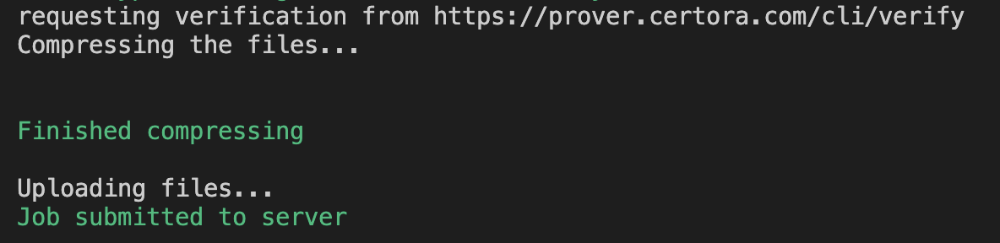

## Additional Useful flags

### `--send_only` flag

As explained in BankLesson1, when running a `certoraRun` command, two steps are executed:

1. Solidity files are compiled and the spec file is locally checked for syntax errors. The following messages should be visible when this step is done:
</br>


2. All necessary files are compressed and then uploaded to Certora’s web server.
The following messages should be visible when this step is done:


These two steps are usually processed quite fast. Next, the terminal will print various information on the console, which may take several minutes to finish. However, sometimes we'd like to use the terminal to execute other tasks while the verification is running on the cloud.
For that, we can abort the terminal run (`Ctrl + C`) after the upload to the cloud is successful. The computation is done on the cloud, so the messages on the console are just progress indicators of the remotely-occurring verification.

Another option that you can use to free up your console after sending a job is the `--send_only` flag. When this flag is used, the console will display the live progress of the first two steps (images above). Then, when the cloud approves receiving the files, the console prints the urls to which the cloud will upload the verification reports once it finishes the computation.

</br>

### `--method` flag

When dealing with parametric rules, we often get violations upon invoking specific functions. When debugging the violation, we usually like to make small changes and run them to see the results. To save time on processing, we can combine the `--rule` option with a `--method` flag to execute a verification of a concrete rule on the specific method that we'd like to investigate.
Since a function can be overloaded in a contract, we should pass the full function signature to the `certoraRun` command to distinguish it. We pass the function signature as a string, enclosed in double quotes.
For example:

```sh
certoraRum A.sol:contractA --verify A:parametric.spec --rule integrity --method "foo(uint256, address, bytes32)"
```

You can read more about it in the documentation [--method](https://certora.atlassian.net/wiki/spaces/CPD/pages/7340043/Certora+Prover+CLI+Options#--method).

</br>

## Exercising Flags - --method and --send_only

> :warning: Make sure that you have the appropriate Solidity compilers on your pc.

 - [ ] Run a verification of the entire `meetings.spec` file with the appropriate solidity compiler and a message of your choice taken as an input. When time is right, abort the run command and invoke a verification on a specific rule of your choice from `ERC20.spec` with a distinct message. Go to the [verifications' job portal](https://prover.certora.com/) to monitor the status on both your runs. Check that both jobs give you results to ensure that you didn't abort the job too early.
 
 - [ ] Create a script that verifies the entire `meetings.spec` file with the appropriate Solidity compiler and a message of your choice taken as an input. Use the `--send_only` to see how the execution behaves.

- [ ] Create a script that verifies a parametric rule of your choice in the `meetings.spec` file with the appropriate Solidity compiler and a message of your choice. Use the `--method` flag to run the verification against the `startMeeting()` method.

- [ ] Run a verification of ***the same parametric rule*** in `meetings.spec` with the appropriate Solidity compiler and a message of your choice. Do not use the `--method` flag.

- [ ] In the [verifications' job portal](https://prover.certora.com/), compare the duration of the three runs - the entire `meeting.spec`, a single parametric rule in `meeting.spec`, and a single rule against a single method of `meeting.spec`.

If time differences don't seem that significant, keep in mind that these are relatively simple examples. In the future, you will encounter runs that may take longer to run.

> :bulb: Remember, you can use `certoraRun --help` command to read more about the flags and the run command syntax.

Upload the scripts for review.