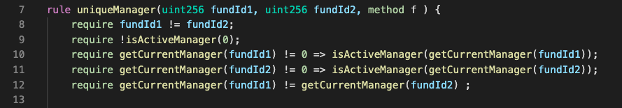

# New Concepts Associated With Invariants

## Pre-conditions Vs. Valid States

</br>

As discussed in [Lesson 7](../../07.Lesson_InductiveReasoning) Certora Prover is over-approximating states to achieve full coverage and provide a proof that a property always holds. However, usually infeasible states (that can never occur at runtime) are also considered. There may be a violation on some of those infeasible states, thus a false negative. These violations can be eliminated by proving the set of reachable states.

In the `Manager` example, we've seen how challenging writing a rule with good coverage is. A rule with partial coverage can be successfully verified and overlook a real bug while giving a user confidence in the code, although it is flawed.

In a moment, we'll have another look at the rule `uniqueManager` and analyze two ways of using a pre-condition. Both should be handled with great caution.
But first, let us define the exact specification for the property:

> Each existing fund should have a unique manager.

Or closer to the way it should be implemented:

> Given any two arbitrary funds, there should be a distinct manager for each of them.

</br>

 

</br>

> :warning: Remember, `require`ing an expression means assuming the expression ***without*** proving it.

Back to the two types of pre-conditions:

1. The `require` in line 8 is a pre-condition that guides the Prover away from a known/uninteresting case.
In This example, if `fundId1 == fundId2`, we get a tautology - in the assertion,  calling `getCurrentManager()` with the exact same argument value should always return the same value; therefore `assert getCurrentManager(fundId1) != getCurrentManager(fundId2)` is equivalent to `assert 1 != 1`. </br>
We can think of this kind of pre-condition as a known restriction to the rule's validity rather than an assumption on a valid state of the contract. We essentially say: "This specification shouldn't hold for any two funds, but only for any two ***distinct*** funds". Since the Prover is over-approximating, if we weren't to require this condition, it would've given us the case where `fundId1 == fundId2` as a counter example. </br>
These sort of assumptions **define** the coverage of the rule and can easily be too strong.</br>
To avoid strong requiring that leads to under-approximation:
    
    a. Specification should be defined cautiously and with great accuracy. For example, we need to refine our specification of the rule:

    > Given any 2 ***distinct*** funds, there should be a distinct manager for each of them.

    b. The pre-conditions should always derive directly from the specification and only create intended coverage boundaries.

    c. Every `require`s should have a good reason.

> :information_source: Frequently, these pre-conditions are local, i.e., relevant to a specific rule(s). Usually, they impose restrictions on internal CVL variables only.

- [ ] Try commenting line 8 out and run a verification on the working implementation to see the counter-example.

</br>

2. The `require` in line 9 is a pre-condition that assumes perpetual validity of a state of the contract.
In this example, we would've missed the bug if the contract could've gotten to the state where `address(0)` is an active manager. 
</br>
This is an unsafe use of a pre-condition (`require`), mainly since it is not derived by the rule's specification.. It is not a guideline to the rule that marks the boundaries of the rule's supposed coverage. Instead, it is a necessary condition that must be met for the property to hold.
This pre-condition is a state that should hold no matter what.  Therefore, it should be proven first in form of another rule/invariant.

- [ ] Search for the introduced bug in the function `createFund()` in [ManagerBug3](Manager/ManagerBug3.sol).

- [ ] Run the spec with line 9 as in the picture above to see if a violation rises.

To avoid making mistakes by assuming things that can not be safely assumed, we introduce the simple concept of `requireInvariavt`.

</br>

---

## requireInvariants

</br>

An invariant can be required using the reserved word `requireInvariant` as follows:

```CVL
invariant exampleInvariant(uint arg1, address arg2, ...)
    exp

rule exampleRule(bytes32 arg1, uint arg2, address arg3, ...){
    requireInvariant exampleInvariant(arg2, arg3);
    
    ...

    assert exp2;
}
```

The `requireInvariant` command inlines the invariant's expression (only!) into the code and assumes it (`require`). It is equivalent to:

```
invariant exampleInvariant(uint arg1, address arg2, ...)
    exp

rule exampleRule(bytes32 arg1, uint arg2, address arg3, ...){
    require exp;
    
    ...

    assert exp2;
}
```

This command allows us to build a more modular code by breaking the specification into rules and invariants that prove exactly one property. As in other programming languages, it is easier to debug and design with shorter and simpler code sections.
If the invariant passes verification, it can be assumed quite safely in any other context. Therefore, the reserved word also helps us visually distinguish between assumptions that we didn't prove before and those with a mathematical basis.  

> :memo: When breaking the code to multiple invariants and rules we can find flaws in the asserts more easily, make violation investigation less tiresome, and allow ourselves to use pre-conditions in a modular and safe way.

> :warning: Note that the code will still assume the invariant where ever it is told to, even if the invariant itself fails. Always make sure that the invariant passes correctly before assuming it.

- [ ] Write the pre-condition in line 9 as an invariant and require this invariant instead of line 9. Run the verification on `ManagerBug3` to see the dissonance of failing the invariant while the rule passes.

</br>

---

## Preserved Blocks

</br>

Another concept we want to introduce is the preserved block for invariants.
The preserved block is a component that allows us to insert a handful of pre-conditions after the post-constructor assert and before calling an arbitrary function, right next to the assumption of the invariant's expression.

If invariants are properties of the system that are supposed to hold on their own for any combination of steps starting from the constructor, why do we need preserved blocks? There are 3 main use cases for invariants with preserved blocks:

1. Invariants with preserved blocks can be thought of as invariants with asterisks - invariants that are true given certain pre-condition after the constructor. We sometimes prefer using invariants in this way over writing a rule to get a wider coverage by including the induction basis (checking the constructor). </br>
Invariants are pretty limited in nature; however, preserved blocks allow the insertion of pre-conditions before the function call.

> :information_source: Rules are much more flexible than invariants. They allow multiple assert lines, specific and numerous function calls, executing additional commands post function calls, and more.

2. Sometimes invariants need to rely on other invariants to work. When this is the case, we can add a preserved block and require those invariants, which is, as we discussed, a safe assumption to make most of the time.

3. The last use case has to do with how the tool operates. Sometimes we need to make assumptions on variables that aren't directly expressed in the invariant's expression or arguments. The most common case is when an invariant that depends on the `env`, or when trying to reduce computation complexity by decreasing the invariant's coverage.

One can create a Preserved Block (PB) that will apply for all methods in the verification context (general PB) or for a specific method in the verification context.

</br>

---

### General Preserved Block

</br>

The general PB is a block that applies pre-conditions before each function call. It is useful when the same assumptions are needed to verify the invariant for multiple different "steps" taken by the system, i.e., different function calls.

The syntax is as follows:

```CVL
invariant aidInv(uint x) 
        exp2

invariant example(address user, bytes32 id) 
    exp
    { 
        preserved
        {
            uint a;
            requireInvariant aidInv(a);
            require user != 0;
        }
    }
```

Notice the syntax - 
- The first curly brackets are used to show the bounds of the PB's declaration.
- There can be more than one PB, so the first curly brackets are there to bound them all.
- Curly brackets after the `preserved` keyword bound the specific preserved block.
- Within the PB, each line must end with a semicolon (;).

An additional feature of the PB is the ability to define an `env` variable within its context. The syntax is as follows:


```CVL
invariant example(address user, bytes32 id) 
    exp
    { 
        preserved with (env e2)
        {
            ...
        }
    }
```

It is handy for the 3rd use case discussed earlier. And it is sometimes necessary when certain function calls require `env`, like some getters.

Since invariants are supposed to be true regardless of anything, including `env` context, the Prover creates and uses a unique environment within the invariant context.

- [ ] Look at the "Variables" box under the violation of the invariant that failed `ManagerBug3`. You can see an `invariantEnv` was created within the invariant context.

</br>

---

### Preserved Block For A Specific Function

</br>

The function-specific PB is similar to the general PB, except it applies to a single method instead of all possible methods.
It is useful for more gentle and focused use of pre-conditions. It allows us to reduce the assumptions across our verification and restrict it only to the case where it is needed.
It is especially recommended to use this option over the general PB Whenever possible, i.e., whenever you make dangerous assumptions that aren't relevant to all induction steps (function call).

The syntax is as follows:

```CVL
invariant example(address user, uint amount) 
    exp
    { 
        preserved getFunds(address user){
            require exp2;
        }
        preserved deposit(uint amount) with (env e2) {
            require exp3;
        }
        preserved withdraw(uint256 amount) with (env e3) {
            require exp4;
        }
    }
```

Notice the syntax here:
- The preserved keyword is followed by the function signature - name and arguments.

You can write a specific PB for each function in your system if needed. For example, in Bank, we can create a preserved block for the methods getFunds(), deposit(), and withdraw().

The PB allows you to constrain method arguments too. For example:

```CVL
invariant example(env e) 
    exp
    {
        preserved transfer(address recipient, uint256 amount) with (env e3) {
            require amount > 0;
        }
    }
```
- `with (env e2)` is a environment variable declaration that will be used in a method. It can have any name.

</br>

---

### General And Function-Specific Preserved Blocks Together

</br>

One can create both a general PB and function-specific PB for the same invariant. In that case, for each contract method with a function-specific PB, the general PB does not apply.

In the example below, when the function `transfer` is being verified, the assumption `amount > 0` will apply, but `hashId == 100` will not. For the verification of any other function, it will be vice versa.

```CVL
invariant example(bytes32 hashId, env e) 
    exp
    {
        preserved with (env e2)
        {
            require hashId == 100;
        }

        preserved transfer(address recipient, uint256 amount) with (env e3) {
            require amount > 0;
        }
    }
```

</br>

---

## Exercise

</br>

- [ ] Have a look at the system [ReserveList](ReserveList) and understand how it operates.

- [ ] Try to prove the following list of properties:

    - [ ] Both lists are correlated - If we use the id of a token in `reserves` to retrieve a token in `underlyingList`, we get the same toke.
    
    <details>
    <summary>Hint:</summary>
    If index i is nonzero and token t is a valid address then t.id equals i iff the i-th reserve is t.</br>
    If i is zero, i-th token is t implies t.id equals i.
    </details>

    </br>
    
    - [ ] There should not be a token saved at an index greater or equal to reserve counter.
    
    <details>
    <summary>Hint:</summary>
    If index i is nonzero and token t is a valid address then t.id equals i iff the i-th reserve is t.</br>
    If i is zero, i-th token is t implies t.id equals i.
    </details>

    </br>

    - [ ] Id of assets is injective (i.e. different tokens should have distinct ids).
    
    <details>
    <summary>Hint:</summary>
    If index i is nonzero and token t is a valid address then t.id equals i iff the i-th reserve is t.</br>
    If i is zero, i-th token is t implies t.id equals i.
    </details>

    </br>
    
    - [ ] Independency of tokens in list - removing one token from the list doesn't affect other tokens.
    
    - [ ] Each non-view function changes reservesCount by 1.

- [ ] If you're able to think of additional interesting properties implement them as well. 

Upload your solutions for review by the Certora Team.
