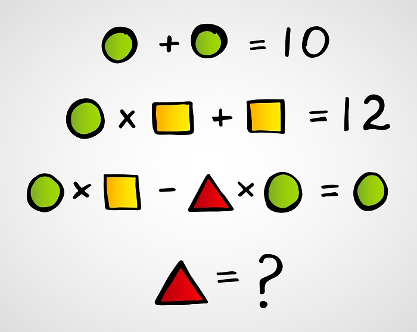
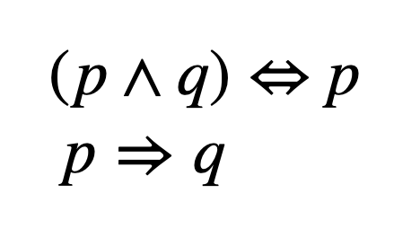

# Solutions to exercises in images:

## Image rule for Z3

</br>



```
(declare-const x Int)
(declare-const y Int)
(declare-const z Int)
(assert (= (+ x x) 10))
(assert (= (+ y (* x y)) 12))
(assert (= (- (* x y) (* z x)) x))
(check-sat)
(get-model)
```

## Write a formula to check if these two equations are equivalent:

</br>




```
(declare-const p Bool)
(declare-const q Bool)
(define-fun conjecture () Bool
    (= (= (and p q) p) 
        (=> p q)))
(assert (not conjecture))
(check-sat)
```